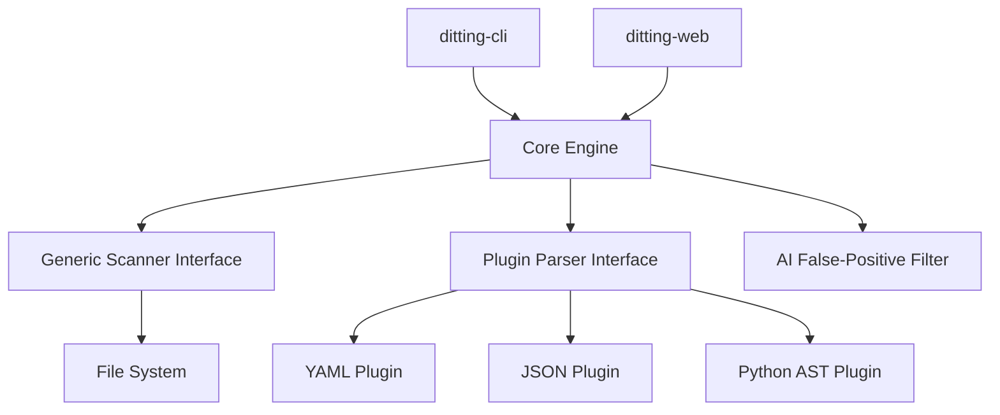

# 谛听 (DiTing) - 高性能代码秘密检测工具

[](https://golang.org)
[](LICENSE)

**谛听 (DiTing)** 是一款基于 Go 语言编写的高性能、插件化静态代码分析工具。它通过扫描代码库中的配置文件、硬编码字符串等，自动识别泄露的秘密信息（如 API Key、密码、Token 等）。

> 本项目是对原 Python 版 [Whispers](https://github.com/Skyscanner/whispers) 的 Go 语言重构版，旨在提供更强的并发能力、极简的部署方式以及通过 AI 驱动的误报过滤。

---

## 🚀 核心特性

*   **⚡ 极速扫描**：利用 Go 语言的原生协程 (Goroutine) 实现高并发文件遍历，扫描速度较原版有质的提升。
*   **🛠️ 整洁架构**：基于 **Clean Architecture** 设计，核心逻辑（Engine）与具体实现（Scanner/Parser）通过接口高度解耦，易于扩展和维护。
*   **🤖 AI 智能审计**：集成 LLM 大模型，对初步扫描结果进行二次语义识别，大幅降低静音扫描中的误报痛点。
*   **📦 零依赖运行**：通过 `//go:embed` 技术将扫描规则和 Web 前端资源打包进单一二进制文件，实现跨平台一键部署。
*   **🧩 模块化插件**：支持 YAML、JSON、Python AST、PlainText 等多种格式的解析插件平滑扩展。

---

## 🏗️ 架构概览



---

## 📅 项目现状

本项目目前处于 **第一阶段：核心骨架与文件扫描** 完结状态。

*   [x] 基于接口的依赖注入架构实现。
*   [x] 后台并发文件遍历引擎。
*   [x] 健壮的错误处理与日志接口。
*   [x] 完善的命令行参数支持 (`-path`, `-v`)。
*   [ ] (下一阶段) 秘密检测规则引擎与基础格式解析。

---

## 🛠️ 快速开始

### 1. 克隆并进入目录
```bash
git clone <repository-url>
cd DiTing
```

### 2. 初始化与运行 (CLI)
如果您尚未初始化 Go 模块：
```bash
go mod init ditting
```

运行扫描（使用默认测试目录）：
```bash
go run cmd/ditting-cli/main.go
```

### ⌨️ 命令行参数

| 参数 | 默认值 | 说明 |
| :--- | :--- | :--- |
| `-path` | `../tests/fixtures` | 指定要扫描的目标目录路径 |
| `-v` | `false` | **详细模式**：开启后将实时打印每一个正在分析的文件路径 |

---

## 📚 详细文档

*   [项目实施阶段说明](docs/implementation_phases.md)
*   [核心模块对照表](docs/implementation_phases.md#核心模块对照表-whispers-vs-ditting)

---

## 📄 开源协议

本项目采用 [MIT License](LICENSE) 许可。
